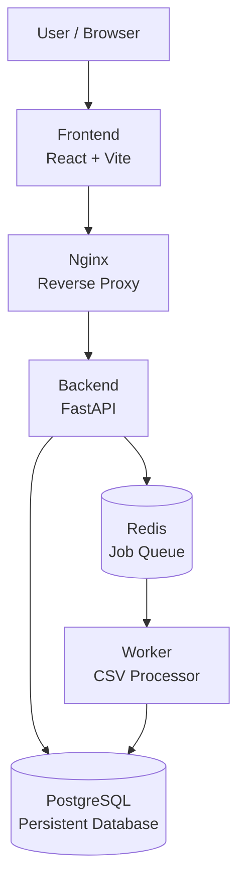
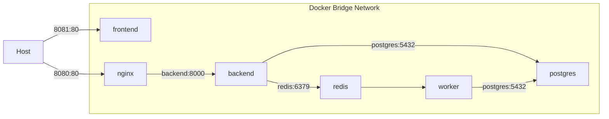
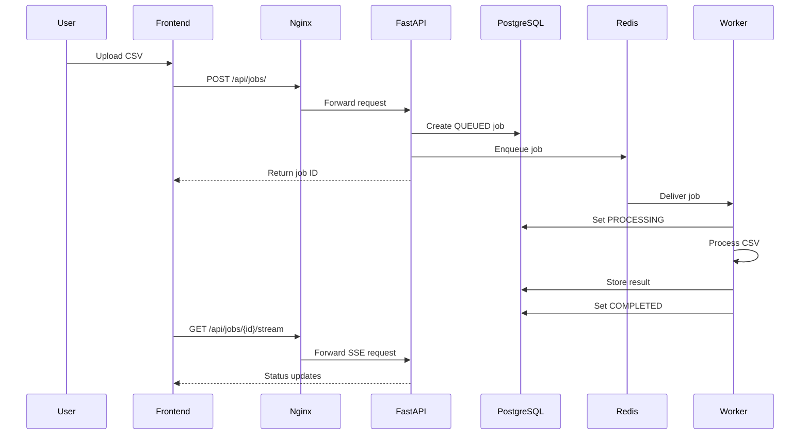

# Distributed Job Processing Platform

A containerized distributed job processing platform built with **Docker and Docker Compose**.

The platform allows users to upload CSV files, create asynchronous processing jobs, monitor job status in real time, and view processing results through a web dashboard.

> **Current release: V1.2.0**

V1 is intentionally focused on building a production-oriented containerized application with Docker and Docker Compose. Kubernetes, CI/CD, Kafka, Terraform, and cloud infrastructure are reserved for later stages of the project roadmap.

---

## Architecture



### Request and Processing Flow

```text
User / Browser
      |
      v
React Frontend
      |
      v
Nginx Reverse Proxy
      |
      v
FastAPI Backend
      |
      +-------------> PostgreSQL
      |
      +-------------> Redis Queue
                           |
                           v
                        Worker
                           |
                           v
                      PostgreSQL
                           |
                           v
                   Frontend / Dashboard
```

### Docker Infrastructure



The application uses the dedicated Docker bridge network:

```text
distributed-job-platform_app_network
```

Containers communicate through Docker service names rather than host IP addresses.

Examples:

```text
nginx   -> backend:8000
backend -> postgres:5432
backend -> redis:6379
worker  -> postgres:5432
worker  -> redis:6379
```

---

## Features

- CSV file upload
- Asynchronous job processing
- Redis-backed job queue
- Dedicated background worker
- PostgreSQL job persistence
- Real-time job status updates using Server-Sent Events
- Completed and failed job tracking
- Job deletion for completed/failed jobs
- Processing results and statistics
- Success-rate dashboard metric
- Average processing-time dashboard metric
- Persistent Docker volumes
- Docker healthchecks
- Docker Secrets for database credentials
- Container restart policies
- CPU and memory limits
- Docker log rotation
- Custom Docker network
- Nginx reverse proxy
- Automated backend tests
- Runtime and development dependency separation

---

## Technology Stack

### Application

- React
- Vite
- FastAPI
- Python
- SQLAlchemy
- PostgreSQL
- Redis

### Infrastructure

- Docker
- Docker Compose
- Nginx

### Testing

- pytest
- FastAPI TestClient
- SQLite test database

---

## Project Structure

```text
distributed-job-platform/
|
├── backend/
│   ├── app/
│   ├── tests/
│   ├── Dockerfile
│   ├── requirements.txt
│   └── requirements-dev.txt
|
├── frontend/
│   ├── src/
│   ├── Dockerfile
│   └── package.json
|
├── worker/
│   ├── worker.py
│   ├── job_service.py
│   ├── csv_processor.py
│   ├── database.py
│   ├── models.py
│   ├── requirements.txt
│   └── Dockerfile
|
├── nginx/
│   └── nginx.conf
|
├── docs/
|
├── compose.yaml
├── .env.example
└── .gitignore
```

The following are created locally at runtime and are intentionally excluded from Git:

```text
.env
secrets/
test.db
backend/test.db
backend/test_uploads/
```

---

## Running the Project

### Prerequisites

Install:

- Docker
- Docker Compose
- Git

### Clone

```bash
git clone https://github.com/harshpant110/distributed-job-platform.git
cd distributed-job-platform
```

### Configuration

Copy the example environment file:

```bash
cp .env.example .env
```

The `.env` file contains non-sensitive configuration:

```env
POSTGRES_DB=jobdb
POSTGRES_USER=jobuser
```

The database password is provided through a Docker Secret.

Create the secret:

```bash
mkdir -p secrets
echo "your-password" > secrets/db_password.txt
```

> **Never commit `secrets/db_password.txt` to Git.**

### Start the Application

```bash
docker compose up -d --build
```

Check the service status:

```bash
docker compose ps
```

Expected services:

```text
postgres
redis
backend
worker
frontend
nginx
```

---

## Accessing the Application

### Frontend

```text
http://localhost:8081
```

### API through Nginx

```text
http://localhost:8080/api
```

### Backend Health

```bash
curl http://localhost:8080/api/health
```

Expected response:

```json
{
  "status": "healthy",
  "service": "backend"
}
```

### Database Health

```bash
curl http://localhost:8080/api/db-health
```

---

## API

The API is exposed through Nginx under the `/api` prefix.

Base URL:

```text
http://localhost:8080/api
```

### Health Check

```http
GET /api/health
```

### Database Health

```http
GET /api/db-health
```

### Create Job

```http
POST /api/jobs/
```

Upload a CSV file:

```bash
curl -X POST   -F "file=@sample.csv"   http://localhost:8080/api/jobs/
```

Initial status:

```text
QUEUED
```

### Get Job

```http
GET /api/jobs/{job_id}
```

Possible job states:

```text
QUEUED
PROCESSING
COMPLETED
FAILED
```

### Job Status Stream

```http
GET /api/jobs/{job_id}/stream
```

The endpoint uses **Server-Sent Events (SSE)** to provide real-time job status updates. The stream terminates when the job reaches `COMPLETED` or `FAILED`.

### Delete Job

```http
DELETE /api/jobs/{job_id}
```

Only completed or failed jobs can be deleted. The associated uploaded file is also removed.

---

## Job Processing Flow



---

## Docker Services

| Service | Purpose | Internal Port | Host Port |
|---|---|---:|---:|
| frontend | React application | 80 | 8081 |
| nginx | Reverse proxy | 80 | 8080 |
| backend | FastAPI API | 8000 | Internal |
| worker | Background processing | — | Internal |
| postgres | Persistent database | 5432 | Internal |
| redis | Job queue | 6379 | Internal |

Only the frontend and Nginx are exposed to the host.

The backend, PostgreSQL, Redis, and worker communicate through the Docker network.

---

## Persistence

PostgreSQL data is stored in the named Docker volume:

```text
postgres_data
```

Uploaded files are stored in:

```text
uploads_data
```

These volumes allow containers to be recreated without losing persistent application data.

To stop and recreate containers while preserving volumes:

```bash
docker compose down
docker compose up -d
```

To remove containers and named volumes:

```bash
docker compose down -v
```

> `docker compose down -v` removes persistent PostgreSQL and uploaded-file data. Use it only when that data can be discarded.

---

## Security Configuration

Database credentials are not hardcoded into the application.

Docker Secrets provide the database password through:

```text
/run/secrets/db_password
```

The repository contains only the non-sensitive example configuration:

```text
.env.example
```

The actual `.env` file and secret directory are excluded from Git.

---

## Reliability

The backend creates the job record before placing the job onto Redis.

If queue submission fails:

1. The job record is removed.
2. The database transaction is rolled back.
3. The uploaded file is removed.
4. The API returns HTTP 500.

This prevents an uploaded file or database record from being left behind as an orphaned queued job when the queue is unavailable.

The queue-failure behavior is covered by an automated test.

---

## Monitoring and Operations

The dashboard exposes:

- Total jobs
- Queued jobs
- Processing jobs
- Completed jobs
- Failed jobs
- Success rate
- Average processing time

Docker operational configuration includes:

- Healthchecks
- Restart policies
- CPU limits
- Memory limits
- Log rotation
- Persistent volumes
- Custom Docker networking
- Docker Secrets

---

## Testing

Development dependencies are separated from production dependencies.

The production backend installs only:

```text
backend/requirements.txt
```

Development and test dependencies are defined in:

```text
backend/requirements-dev.txt
```

### Install Development Dependencies

```bash
cd backend
python -m venv .venv
source .venv/bin/activate
pip install -r requirements-dev.txt
```

### Run Tests

```bash
pytest -q
```

V1.2.0 contains **9 automated backend tests** covering:

- Health endpoint
- Invalid file type
- Empty file
- Job creation
- Queue enqueue failure
- Nonexistent job lookup
- Nonexistent job deletion
- Deletion protection for queued jobs
- Successful deletion of completed jobs

Current validation result:

```text
9 passed
```

---

## Useful Docker Commands

### Start

```bash
docker compose up -d
```

### Build and Start

```bash
docker compose up -d --build
```

### Check Services

```bash
docker compose ps
```

### View All Logs

```bash
docker compose logs
```

### Follow a Service

```bash
docker compose logs -f backend
```

### Restart a Service

```bash
docker compose restart backend
```

### Stop Containers

```bash
docker compose down
```

### Stop Containers and Remove Volumes

```bash
docker compose down -v
```

### Validate the Resolved Compose Configuration

```bash
docker compose config
```

### Inspect a Container

```bash
docker exec -it job-platform-backend /bin/sh
```

---

## Operational Validation

V1.2.0 was validated through application-level and container-level checks.

### Backend Tests

```text
9 passed
```

### Frontend Production Build

The Vite production build completed successfully.

### Docker Validation

All six services were successfully started:

```text
postgres
redis
backend
worker
frontend
nginx
```

PostgreSQL and Redis reported healthy status through their Docker healthchecks.

The backend reported:

```json
{
  "status": "healthy",
  "service": "backend"
}
```

The production backend image was verified not to contain the development-only `pytest` dependency.

The application was also validated through the Nginx reverse proxy with CSV job creation and processing.

---

## Version Roadmap

### V1 — Docker + Docker Compose

**Current stage — V1.2.0**

Focus:

- Containerization
- Dockerfiles
- Docker Compose
- Service networking
- Docker DNS
- Persistent storage
- Docker Secrets
- Healthchecks
- Resource limits
- Log rotation
- Nginx reverse proxy
- Redis-backed job processing
- Background worker
- Automated testing
- Operational dashboard metrics

### V2 — Kubernetes

Planned:

- Deployments
- Services
- ConfigMaps
- Secrets
- Persistent storage
- Kubernetes networking
- Liveness and readiness probes
- Replica scaling

### V3 — CI/CD

Planned:

- Automated testing
- Docker image builds
- Image publishing
- Automated deployment

### V4 — Event-Driven Architecture

Planned:

- Kafka
- Event-driven job processing
- Distributed consumers
- Event-based communication

### V5 — Infrastructure as Code + Cloud

Planned:

- Terraform
- Cloud deployment
- Managed databases
- Managed Kubernetes
- Production infrastructure

The same application will evolve through each stage rather than being replaced by unrelated projects.

---

## Release History

| Release | Focus |
|---|---|
| **V1.0.0** | Docker foundation and infrastructure hardening |
| **V1.1.0** | Real-time job status updates |
| **V1.1.1** | Job management and dashboard controls |
| **V1.2.0** | Automated tests, queue reliability, configuration hardening, and operational metrics |

### V1.2.0 Highlights

- Automated backend test suite
- Queue failure rollback
- Runtime/development dependency separation
- Dashboard operational metrics
- Docker Secret-based database credentials
- Production Docker validation
- Persistent storage validation
- Healthcheck validation
- CPU and memory limits
- Docker log rotation

---

## License

This project is currently intended as a learning and portfolio project.
