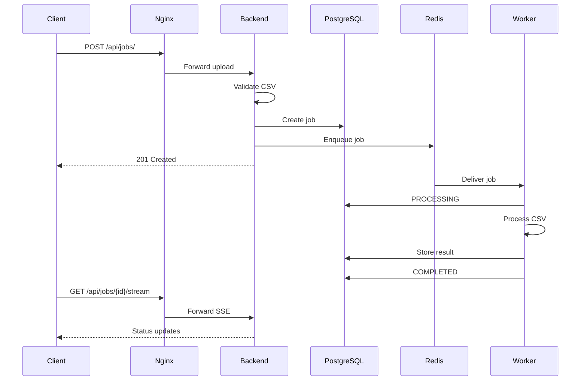

# API Documentation

## Overview

The Distributed Job Processing Platform exposes a REST API through the Nginx reverse proxy.

The API is implemented using FastAPI.

The backend itself is internal to the Docker network. External API requests are routed through Nginx.

### Base URL

```text
http://localhost:8080/api
```

---

## API Architecture

```text
Client
  |
  v
Nginx :8080
  |
  v
Backend :8000
  |
  +------> PostgreSQL
  |
  +------> Redis
```

---

# Health Endpoints

## `GET /api/health`

Checks whether the backend application is responding.

### Request

```bash
curl http://localhost:8080/api/health
```

### Response

```json
{
  "status": "healthy",
  "service": "backend"
}
```

### Status Code

```text
200 OK
```

---

## `GET /api/db-health`

Checks database connectivity from the backend.

### Request

```bash
curl http://localhost:8080/api/db-health
```

A successful response indicates that the backend can connect to PostgreSQL.

---

# Job Endpoints

## `POST /api/jobs/`

Creates a new CSV processing job.

### Request

The endpoint expects a multipart file upload.

```bash
curl -X POST \
  -F "file=@sample.csv" \
  http://localhost:8080/api/jobs/
```

### Supported File Type

Only CSV files are accepted.

Example:

```text
sample.csv
```

Non-CSV uploads are rejected.

### Upload Limit

The application supports files up to:

```text
10 MB
```

The limit is enforced at both the application and Nginx layers.

### Successful Response

A successful request creates a job with an initial state of:

```text
QUEUED
```

The response contains information including:

```text
id
filename
file_path
status
created_at
```

### Job Creation Flow

```text
CSV Upload
    |
    v
Validate File
    |
    v
Save File
    |
    v
Create Database Job
    |
    v
Enqueue Redis Job
    |
    v
Return Job Information
```

---

# Job Status

A job can have one of four states:

```text
QUEUED
PROCESSING
COMPLETED
FAILED
```

## `QUEUED`

The job has been created and submitted to Redis.

## `PROCESSING`

The worker has received the job and is processing the CSV.

## `COMPLETED`

The worker successfully processed the CSV and stored the result.

## `FAILED`

Processing or another job operation failed.

---

# Get Job

## `GET /api/jobs/{job_id}`

Returns information about a specific job.

### Request

```bash
curl http://localhost:8080/api/jobs/<JOB_ID>
```

Replace:

```text
<JOB_ID>
```

with the UUID returned when the job was created.

### Example

```bash
curl \
  http://localhost:8080/api/jobs/95f1e0a6-4b53-4bf5-b57b-810d4e56709c
```

### Completed Job

A completed job can include processing information such as:

```text
rows
columns
file_size_bytes
processing_time_seconds
```

The exact result fields are determined by the CSV processing implementation.

---

# Real-Time Job Status

## `GET /api/jobs/{job_id}/stream`

Provides real-time status updates using **Server-Sent Events (SSE)**.

### Request

```bash
curl -N \
  http://localhost:8080/api/jobs/<JOB_ID>/stream
```

The `-N` option prevents curl from buffering the SSE response.

### Flow

```text
Frontend
   |
   | SSE connection
   v
Nginx
   |
   v
Backend
   |
   v
PostgreSQL
```

The backend monitors the job state and sends updates when the status changes.

The stream terminates when the job reaches a terminal state:

```text
COMPLETED
```

or:

```text
FAILED
```

---

# Delete Job

## `DELETE /api/jobs/{job_id}`

Deletes a completed or failed job.

### Request

```bash
curl -X DELETE \
  http://localhost:8080/api/jobs/<JOB_ID>
```

### Deletion Rules

Only jobs in these states can be deleted:

```text
COMPLETED
FAILED
```

Jobs in:

```text
QUEUED
PROCESSING
```

cannot be deleted through this endpoint.

### Successful Response

A successful deletion returns a confirmation message and the deleted job ID.

The associated uploaded file is also removed.

---

# Error Responses

The API uses HTTP status codes to communicate errors.

Common responses include:

| Status | Meaning |
|---:|---|
| `200` | Successful request |
| `201` | Job successfully created |
| `400` | Invalid request or unsupported file |
| `404` | Job not found |
| `409` | Operation conflicts with current job state |
| `500` | Internal processing or queue failure |

---

## Invalid File

Uploading a non-CSV file returns:

```text
400 Bad Request
```

Example response:

```json
{
  "detail": "Only CSV files are supported"
}
```

---

## Empty File

An empty upload is rejected.

Example response:

```json
{
  "detail": "Uploaded file is empty"
}
```

---

## Job Not Found

Requesting a nonexistent job returns:

```text
404 Not Found
```

Example:

```json
{
  "detail": "Job not found"
}
```

---

## Invalid Deletion State

Attempting to delete a queued or processing job returns:

```text
409 Conflict
```

Example:

```json
{
  "detail": "Only completed or failed jobs can be deleted"
}
```

---

# Queue Failure Handling

Job creation includes a reliability mechanism for Redis failures.

The normal sequence is:

```text
Create Job
    |
    v
Commit Job
    |
    v
Enqueue Redis
```

If Redis enqueueing fails:

```text
Redis Failure
     |
     v
Delete Job
     |
     v
Rollback Database State
     |
     v
Delete Uploaded File
     |
     v
HTTP 500
```

The API returns:

```json
{
  "detail": "Failed to create and queue job"
}
```

This prevents orphaned queued jobs.

The behavior is covered by an automated backend test.

---

# End-to-End Example

## 1. Create a CSV

```bash
cat > sample.csv <<EOF
name,age
Harsh,19
Alice,20
Bob,21
EOF
```

## 2. Submit the Job

```bash
curl -X POST \
  -F "file=@sample.csv" \
  http://localhost:8080/api/jobs/
```

Copy the returned job ID.

Example:

```text
95f1e0a6-4b53-4bf5-b57b-810d4e56709c
```

## 3. Check the Job

```bash
curl \
  http://localhost:8080/api/jobs/95f1e0a6-4b53-4bf5-b57b-810d4e56709c
```

## 4. Follow Status Updates

```bash
curl -N \
  http://localhost:8080/api/jobs/95f1e0a6-4b53-4bf5-b57b-810d4e56709c/stream
```

## 5. Check the Completed Result

```bash
curl \
  http://localhost:8080/api/jobs/95f1e0a6-4b53-4bf5-b57b-810d4e56709c
```

## 6. Delete the Completed Job

```bash
curl -X DELETE \
  http://localhost:8080/api/jobs/95f1e0a6-4b53-4bf5-b57b-810d4e56709c
```

---

# API Request Lifecycle

The complete lifecycle is:



---

# API and Docker Boundary

The client never needs direct access to PostgreSQL or Redis.

```text
                    Host
                     |
             ┌───────┴───────┐
             |               |
          :8081            :8080
             |               |
          Frontend          Nginx
                             |
                             v
                          Backend
                         /       \
                        v         v
                   PostgreSQL    Redis
                                  |
                                  v
                                Worker
```

This keeps the internal services inside the Docker network.

---

# Related Documentation

- [System Architecture](architecture.md)
- [Docker Implementation](docker.md)
- [Testing](testing.md)
- [Operations](operations.md)
- [Project Roadmap](roadmap.md)