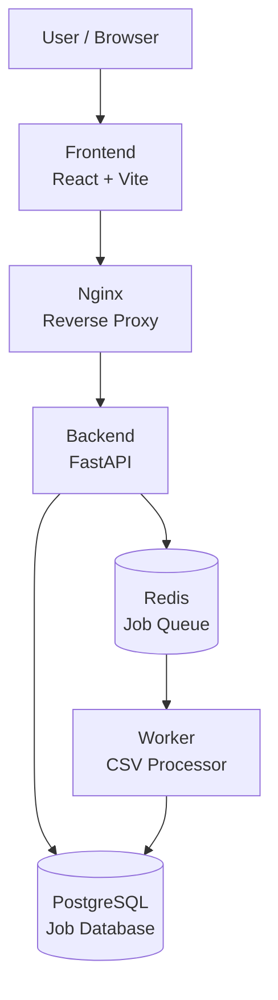
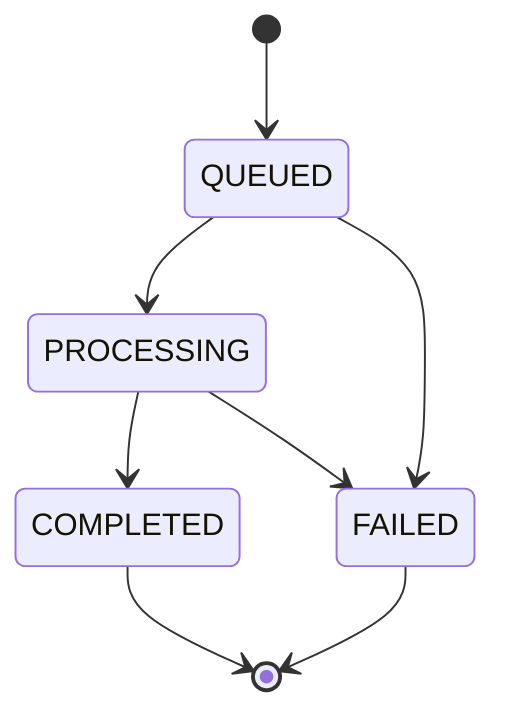

# System Architecture

## Overview

The Distributed Job Processing Platform is a containerized application designed to accept CSV processing jobs, place them on a Redis-backed queue, process them asynchronously using a dedicated worker, and persist job state and results in PostgreSQL.

V1.2.0 uses Docker and Docker Compose as the infrastructure layer.

The system consists of six containers:

- Frontend
- Nginx
- Backend
- Worker
- Redis
- PostgreSQL

---

## High-Level Architecture



---

## Components

### Frontend

The frontend provides the user interface for:

- Uploading CSV files
- Viewing jobs
- Monitoring job status
- Viewing processing results
- Viewing operational dashboard metrics
- Deleting completed or failed jobs

The frontend is built with React and Vite.

The production frontend is packaged into an Nginx container.

---

### Nginx

Nginx acts as the reverse proxy between the frontend and backend.

It:

- Exposes the API to the host
- Routes `/api/` requests to the backend
- Applies the 10 MB upload limit
- Handles HTTP proxying
- Disables proxy buffering for real-time responses
- Provides a long proxy read timeout for SSE connections

The backend itself is not exposed directly to the host.

---

### Backend

The backend is implemented with FastAPI.

Responsibilities include:

- Receiving CSV uploads
- Validating uploaded files
- Creating job records
- Placing jobs onto Redis
- Returning job information
- Providing job status
- Providing real-time status streams
- Deleting completed or failed jobs
- Providing health endpoints

The backend communicates with PostgreSQL and Redis through the Docker network.

---

### Redis

Redis acts as the job queue.

The backend places newly created jobs onto Redis.

The worker consumes those jobs and performs the actual CSV processing.

This separates HTTP request handling from background processing.

---

### Worker

The worker is a separate container responsible for asynchronous processing.

Its workflow is:

```text
Receive job
    ↓
Load job from PostgreSQL
    ↓
Set status to PROCESSING
    ↓
Read CSV
    ↓
Process CSV
    ↓
Store result
    ↓
Set status to COMPLETED
```

If processing fails, the job is marked:

```text
FAILED
```

---

### PostgreSQL

PostgreSQL stores persistent job information.

A job contains information such as:

- UUID
- Filename
- File path
- Status
- Creation time
- Start time
- Completion time
- Processing result
- Error information

PostgreSQL data is persisted through the Docker named volume:

```text
postgres_data
```

---

## Docker Network Architecture

All application services communicate through a dedicated Docker bridge network:

```text
distributed-job-platform_app_network
```

Docker service discovery allows containers to communicate using service names.

```text
nginx   → backend:8000
backend → postgres:5432
backend → redis:6379
worker  → postgres:5432
worker  → redis:6379
```

No container needs to know another container's IP address.

---

## Request Flow

A normal job creation request follows this path:

```text
Browser
   ↓
Frontend
   ↓
Nginx
   ↓
Backend
   ↓
PostgreSQL
   ↓
Redis
```

The backend first creates the job record and then submits the job to Redis.

The backend returns the job information to the frontend without waiting for CSV processing to finish.

---

## Background Processing Flow

After the job enters Redis:

```text
Redis
  ↓
Worker
  ↓
PostgreSQL
```

The worker updates the job state as processing progresses.

The final state is either:

```text
COMPLETED
```

or:

```text
FAILED
```

---

## Real-Time Status Flow

The frontend can subscribe to:

```text
GET /api/jobs/{job_id}/stream
```

The endpoint uses Server-Sent Events.

The backend periodically checks the job state and sends updates when the status changes.

The stream ends when the job reaches a terminal state:

```text
COMPLETED
FAILED
```

This allows the dashboard to update without repeatedly refreshing the entire page.

---

## Job Lifecycle



### States

#### QUEUED

The job has been created and placed into the processing queue.

#### PROCESSING

The worker has received the job and is processing the CSV.

#### COMPLETED

Processing finished successfully and the result was stored.

#### FAILED

Processing failed or an error occurred during execution.

---

## Reliability Boundary

Job creation follows this sequence:

```text
Create database record
        ↓
Commit job
        ↓
Enqueue job in Redis
```

If Redis enqueueing fails, the backend removes the database record and deletes the uploaded file.

```text
Redis enqueue failure
        ↓
Remove job
        ↓
Rollback database state
        ↓
Delete uploaded file
        ↓
Return HTTP 500
```

This prevents orphaned queued jobs.

The behavior is covered by an automated test.

---

## Data Persistence

Two named Docker volumes are used:

```text
postgres_data
uploads_data
```

### PostgreSQL Volume

```text
postgres_data
        ↓
/var/lib/postgresql/data
```

### Upload Volume

```text
uploads_data
        ↓
/app/uploads
```

These volumes are independent of individual application containers.

Therefore:

```text
Container recreation
        ≠
Data deletion
```

Data is removed only when the corresponding Docker volumes are explicitly removed.

---

## Security Boundaries

The application separates host-facing services from internal services.

### Host-facing

```text
Frontend → 8081
Nginx    → 8080
```

### Internal

```text
Backend
PostgreSQL
Redis
Worker
```

The backend, PostgreSQL, and Redis ports are not published to the host.

Database credentials are supplied using Docker Secrets rather than hardcoded credentials.

---

## V1 Architectural Scope

V1 intentionally uses:

```text
Docker
Docker Compose
Nginx
FastAPI
PostgreSQL
Redis
React
```

The following technologies are intentionally outside the V1 scope:

```text
Kubernetes
CI/CD
Kafka
Terraform
Cloud infrastructure
```

They will be introduced progressively in later versions so that each technology solves a concrete architectural requirement.

---

## Evolution

The architecture is designed to evolve without replacing the application.

```text
V1
Docker + Docker Compose
        ↓
V2
Kubernetes
        ↓
V3
CI/CD
        ↓
V4
Kafka / Event-Driven Architecture
        ↓
V5
Terraform + Cloud
```

The application remains the same core distributed job-processing platform while its infrastructure evolves.