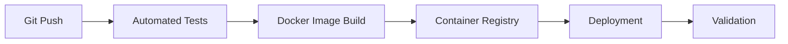
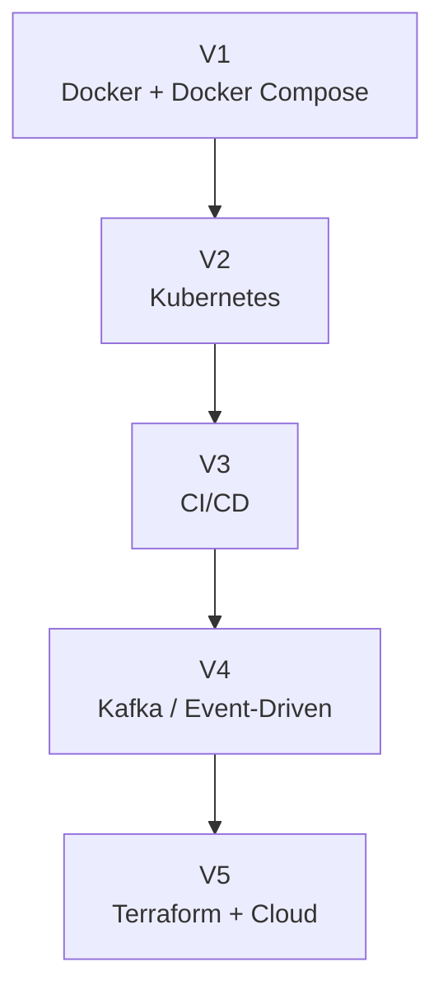

# Project Roadmap

## Overview

The Distributed Job Processing Platform is being developed as a single evolving system.

The goal is to progressively introduce infrastructure and distributed-systems technologies while keeping the application itself consistent.

The roadmap is:

```text
V1
Docker + Docker Compose
        ↓
V2
Kubernetes
        ↓
V3
CI/CD
        ↓
V4
Kafka / Event-Driven Architecture
        ↓
V5
Terraform + Cloud
```

Each stage introduces a technology because the architecture has reached a point where that technology provides a concrete engineering capability.

---

# V1 — Docker + Docker Compose

## Status

**Completed — V1.2.0**

V1 establishes the complete containerized application.

### Application Architecture

```text
React
  ↓
Nginx
  ↓
FastAPI
  ├── PostgreSQL
  └── Redis
        ↓
      Worker
        ↓
    PostgreSQL
```

### Technologies

```text
React
Vite
FastAPI
Python
SQLAlchemy
PostgreSQL
Redis
Docker
Docker Compose
Nginx
pytest
```

### Infrastructure Capabilities

V1 implements:

- Dockerfiles
- Docker Compose
- Custom Docker networking
- Docker DNS
- Port publishing
- Named volumes
- Bind mounts
- Environment variables
- Docker Secrets
- Healthchecks
- Service dependencies
- Restart policies
- CPU limits
- Memory limits
- Docker log rotation
- Nginx reverse proxy

### Application Capabilities

The application supports:

- CSV uploads
- Asynchronous job processing
- Redis-backed queue
- Background worker
- PostgreSQL persistence
- Real-time job status
- Job results
- Completed/failed job management
- Dashboard metrics

### Reliability

V1.2.0 adds protection against queue submission failures.

If Redis enqueueing fails:

```text
Job creation
     ↓
Redis failure
     ↓
Remove database job
     ↓
Delete uploaded file
     ↓
Return HTTP 500
```

### Testing

V1.2.0 includes:

```text
9 automated backend tests
```

The release was also validated with:

- Frontend production build
- Docker Compose deployment
- Container healthchecks
- Database connectivity
- Redis connectivity
- End-to-end CSV processing
- Persistent volume validation
- Production dependency validation

---

# V2 — Kubernetes

## Goal

Move the application from single-host Docker Compose orchestration to Kubernetes orchestration.

The application itself should remain substantially the same.

The primary change will be the orchestration layer.

### Current Limitation

Docker Compose runs the complete application on a single Docker host.

For example:

```text
Single Host
│
├── frontend
├── nginx
├── backend
├── worker
├── redis
└── postgres
```

Kubernetes will introduce cluster-level orchestration.

---

## Planned Architecture

```text
Kubernetes Cluster
│
├── Frontend Deployment
├── Nginx Deployment
├── Backend Deployment
├── Worker Deployment
├── Redis
└── PostgreSQL
```

Services will provide stable network identities for application components.

---

## Kubernetes Concepts to Introduce

### Deployments

Deployments will manage application workloads such as:

```text
backend
worker
frontend
nginx
```

### Services

Services will provide stable networking between Kubernetes workloads.

For example:

```text
backend-service
redis-service
postgres-service
```

### ConfigMaps

Non-sensitive configuration will move from local Compose configuration toward Kubernetes configuration resources.

### Secrets

Database credentials will move from Docker Secrets to Kubernetes Secrets.

### PersistentVolumes

Persistent storage will be represented using Kubernetes storage primitives.

### Probes

Docker healthchecks will evolve into Kubernetes:

```text
Liveness Probes
Readiness Probes
```

### Scaling

The worker and backend will become candidates for multiple replicas.

Conceptually:

```text
Backend
├── Replica 1
├── Replica 2
└── Replica 3
```

and:

```text
Worker
├── Replica 1
├── Replica 2
└── Replica 3
```

The exact replica configuration will be determined during V2 implementation.

---

## V2 Learning Goals

The focus will be:

- Kubernetes architecture
- Pods
- Deployments
- Services
- ConfigMaps
- Secrets
- PersistentVolumes
- Probes
- Replica management
- Resource requests and limits
- Kubernetes networking

---

# V3 — CI/CD

## Goal

Automate the path from source-code change to tested container image and deployment.

The current workflow is manual:

```text
Code
 ↓
Test
 ↓
Build Docker image
 ↓
Run Compose/Kubernetes
 ↓
Verify
```

CI/CD will automate these steps.

---

## Planned Pipeline



### CI

The CI stage will perform:

- Automated backend tests
- Frontend build
- Docker image build
- Validation checks

### Container Images

Images will be built automatically and published to a container registry.

### CD

The deployment stage will update the running Kubernetes application.

---

## V3 Learning Goals

- CI pipelines
- CD pipelines
- Git-based automation
- Container registries
- Image tagging
- Automated testing
- Deployment automation
- Release management

---

# V4 — Kafka / Event-Driven Architecture

## Goal

Introduce event-driven processing when the job-processing architecture has a concrete requirement for a dedicated event streaming platform.

The current architecture uses Redis as the job queue:

```text
Backend
   ↓
Redis
   ↓
Worker
```

Kafka will introduce an event-streaming layer.

---

## Planned Architecture

```text
Backend
   ↓
Kafka
   ↓
Worker Consumers
   ↓
PostgreSQL
```

Multiple workers may consume events through consumer groups.

Conceptually:

```text
                    Kafka
                      |
             ┌────────┼────────┐
             ↓        ↓        ↓
          Worker 1 Worker 2 Worker 3
             |        |        |
             └────────┼────────┘
                      ↓
                  PostgreSQL
```

---

## Event-Driven Model

A job submission could produce an event such as:

```text
JobCreated
```

The worker consumes the event and processes the CSV.

Additional events could eventually represent:

```text
JobStarted
JobCompleted
JobFailed
```

The exact event schema will be defined when V4 is implemented.

---

## V4 Learning Goals

- Kafka architecture
- Topics
- Partitions
- Producers
- Consumers
- Consumer groups
- Event schemas
- Event ordering
- Delivery semantics
- Distributed workers
- Event-driven design

---

# V5 — Terraform + Cloud

## Goal

Move infrastructure provisioning from manually managed environments to Infrastructure as Code and cloud infrastructure.

The target architecture will combine:

```text
Terraform
+
Cloud Infrastructure
+
Kubernetes
+
CI/CD
+
Kafka
```

---

## Planned Infrastructure

Potential infrastructure areas include:

```text
Cloud Networking
Kubernetes Cluster
Managed PostgreSQL
Container Registry
Object Storage
Monitoring
Secrets
Load Balancing
```

The exact cloud provider and services will be selected when V5 begins.

---

## Terraform

Terraform will define infrastructure declaratively.

Conceptually:

```text
Terraform
    |
    +── Network
    |
    +── Kubernetes
    |
    +── Database
    |
    +── Registry
    |
    +── Storage
```

Infrastructure changes will be represented as code rather than manually configured resources.

---

# Complete Evolution

The full project evolution is:



---

# Why the Technologies Are Introduced Progressively

The project intentionally avoids adding infrastructure technologies without an architectural reason.

## Docker

Provides:

```text
Containerization
Isolation
Reproducibility
```

## Docker Compose

Provides:

```text
Multi-container orchestration
Local service networking
Configuration
Persistent volumes
```

## Kubernetes

Will provide:

```text
Cluster orchestration
Replica management
Service discovery
Self-healing workloads
Scaling
```

## CI/CD

Will provide:

```text
Automated validation
Automated image builds
Automated deployment
```

## Kafka

Will provide:

```text
Event streaming
Distributed consumers
Event-driven communication
```

## Terraform

Will provide:

```text
Infrastructure as Code
Repeatable infrastructure provisioning
Infrastructure version control
```

---

# Project Principle

The project follows one central principle:

> **Keep the application, evolve the infrastructure.**

The CSV job-processing application should continue through every stage.

The infrastructure surrounding it becomes progressively more capable:

```text
Single Host
    ↓
Containerized Application
    ↓
Kubernetes Cluster
    ↓
Automated Delivery
    ↓
Event-Driven Processing
    ↓
Cloud Infrastructure
```

This creates one continuous engineering project rather than a collection of unrelated technology demonstrations.

---

# V1.2.0 Baseline

The stable baseline for future development is:

```text
Release: v1.2.0
```

Git tag:

```text
v1.2.0
```

Future versions should be developed from this validated baseline.

The V1.2.0 state provides:

- Containerized application
- Persistent storage
- Redis-backed processing
- Background worker
- Healthchecks
- Secrets
- Resource controls
- Logging controls
- Automated tests
- Operational metrics
- Production Docker validation

This baseline will become the starting point for V2 Kubernetes work.